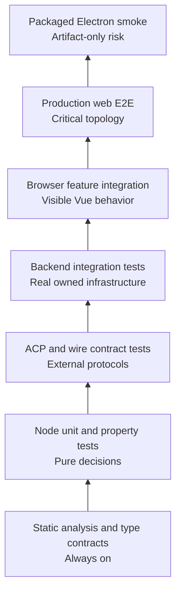

# MetaClanker testing strategy

- Status: Proposed
- Owner: Engineering and quality
- Audience: Contributors, coding agents, reviewers, and release owners
- Related contract: [MetaClanker product and architecture specification](architecture.md)

## 1. Executive summary

MetaClanker uses a testing pyramid optimized for confidence per maintenance cost. Static analysis
forms the base. Focused unit and property tests protect pure decisions. Contract tests protect ACP and
public wire boundaries. Most behavioral confidence comes from integration tests using real
MetaClanker-owned infrastructure. Browser tests prove user-visible Vue behavior in Chromium. A very
small Playwright suite proves the production topology, and packaged-artifact smoke tests cover risks
that exist only after Electron packaging.

The repository already has the required runners, named Vitest projects, production E2E journeys,
packaged Electron smoke, mutation testing, and CI jobs. The main deficiency is not tooling; it is that
the reusable harnesses and behavioral coverage are still narrow. This specification defines where
each behavior belongs and the changes required to complete the strategy without introducing
duplicate tests or additional runners.

This document refines Sections 10 and 11 of the root specification. If the documents conflict, the
root specification remains authoritative and the discrepancy must be resolved explicitly.

## 2. Goals and non-goals

### 2.1 Goals

- Give every meaningful behavior one primary test owner.
- Exercise the most realistic boundary that remains deterministic and inexpensive.
- Make failures identify the responsible architectural layer.
- Test backend collaboration with real SQLite, Git, filesystem, and ACP stdio boundaries.
- Test visible behavior through real Vue components in Chromium.
- Keep production E2E small, stable, and representative.
- Make asynchronous tests await semantic completion rather than elapsed time.
- Provide one reusable harness per test boundary.
- Require regression tests for defects and failure-mode tests for backend mutations.
- Preserve local-first privacy and isolate all test state from real user data.

### 2.2 Non-goals

- Maximizing test count or repository-wide line coverage.
- Repeating the same assertion at every layer.
- Unit-testing trivial framework wiring, getters, constructors, or pass-through functions.
- Mocking MetaClanker internals merely to make a test easier to write.
- Replacing compiler checks with runtime tests.
- Running authenticated Codex or Claude tests on ordinary pull requests.
- Building a large, slow E2E suite for behavior lower layers can prove more precisely.
- Adding another test runner, render helper, fake server, assertion library, or retry mechanism.

## 3. The MetaClanker testing pyramid



The pyramid describes ownership and frequency, not value. Higher layers are essential but narrower.
They prove that lower-layer pieces collaborate through their production boundaries; they do not
retest every edge case.

### 3.1 Core ownership rule

Each behavior belongs to the cheapest layer that can exercise its real contract:

1. If the compiler can reject it, use a static or type-contract test.
2. If it is a pure decision, use a unit or property test.
3. If it concerns serialization or an external protocol, use a contract test.
4. If it concerns collaboration between backend services, use an integration test.
5. If the user sees or controls it, use a browser feature test.
6. If confidence requires the built client and server together, use production E2E.
7. If the failure exists only after Electron packaging, use packaged smoke.

One behavior may have supporting assertions elsewhere, but exactly one layer owns its complete
contract.

## 4. Current state

The repository has the complete lane topology and exercises the principal cross-layer contracts:

| Lane                | Current implementation                                                              | Main gap                                                                    |
| ------------------- | ----------------------------------------------------------------------------------- | --------------------------------------------------------------------------- |
| Static and types    | Strict TypeScript, `vue-tsc`, import-boundary lint, branded IDs, focused-test guard | Continue expanding public union and preload bridge contracts                |
| Node unit/property  | Domain graph/thread/events, live reducers, auth, title, and lifecycle workers       | More generated recovery and permission-policy sequences                     |
| ACP contract        | Real production supervisor over deterministic stdio scenarios                       | Add new provider capability variants whenever adapters expand               |
| Backend integration | SQLite journal/projection replay, orchestration, recovery, Git checkpoints          | Add Nitro/WebSocket edge cases only where lower lanes cannot own them       |
| Browser integration | Project/draft navigation, conversation live status, keyboard and accessibility      | Add reconnect and long-transcript behavior as visible regressions are found |
| Production web E2E  | Two critical fake-provider journeys                                                 | Keep narrow; strengthen assertions rather than adding breadth               |
| Packaged Electron   | Startup, native SQLite, renderer, readiness, and shutdown smoke                     | Minimal prompt path and explicit preload surface verification               |
| Mutation            | Scheduled graph/thread baseline                                                     | Expand only as new critical pure policy modules appear                      |

The target is not a prescribed number of tests. Coverage grows when product behavior grows or a
failure reveals an unowned contract.

## 5. Test lanes

### 5.1 Static analysis and type contracts

#### Owns

- TypeScript and Vue template correctness.
- Architecture and import boundaries.
- Exhaustive command, event, error, and state unions.
- Branded identifier separation.
- Public package API shapes.
- Electron preload bridge shape.
- Component prop, slot, and emit contracts where compile-time failure is intentional.

#### Does not own

- Runtime schema decoding.
- Persistence or transport behavior.
- User-visible rendering.

#### Location and commands

- Files: colocated `*.test-d.ts` files.
- Commands: `pnpm test:types`, `pnpm lint`, and `pnpm knip`.

#### Example

```ts
declare const projectId: ProjectId;
declare const openThread: (threadId: ThreadId) => void;

// @ts-expect-error ProjectId must not cross a ThreadId boundary.
openThread(projectId);
```

### 5.2 Node unit and property tests

#### Owns

- Pure domain transitions and state derivation.
- Graph reduction and deterministic layout inputs.
- Recovery and status policies.
- Permission and path-containment policies.
- Message, title, tool-call, and provider-event normalization.
- Settings and schema migrations expressed as pure transformations.
- Idempotency decisions that do not require persistence.

Use property testing when generated inputs or operation sequences reveal substantially more than a
few examples. Good candidates include path containment, event ordering, chunk assembly, graph
invariants, command idempotency models, and settings migrations.

#### Does not own

- SQLite transactions.
- ACP stdio framing.
- Vue, Pinia, router, or browser behavior.
- Simple getters, constructors, or pass-through wrappers.

#### Location and command

- Files: colocated `*.unit.test.ts`.
- Command: `pnpm test:unit`.

#### Effect tests

Effect-backed Node tests use `@effect/vitest`, pinned to the selected Effect 4 beta tuple and wrapping
the existing Vitest runner; it is not another test lane or runner. Use `it.effect` for deterministic
Effect programs and `it.live` only when a test genuinely needs the live clock, filesystem, subprocess,
Git, lock, or SQLite. Each test builds fresh scoped mutable infrastructure. Use `Effect.exit` to assert
typed failures. `it.flakyTest`, Vitest retries, and elapsed-time success conditions remain prohibited.

The TypeScript baseline keeps `strict` enabled and must remain at least as strict as the Effect
package requirement. ESLint warns on new named imports from the `effect` barrel; use namespace
submodule imports such as `import * as Effect from "effect/Effect"` in new backend code. The warning
is a migration ratchet until the existing imports are converted deliberately.

#### Example

```ts
it("marks a disconnected active turn as recovery-required", () => {
  const next = recoverInterruptedThread(runningThread);

  expect(next.status).toBe("recovery-required");
});
```

### 5.3 Wire and ACP contract tests

#### Owns

- Effect Schema decoding and encoding at public boundaries.
- HTTP and WebSocket request/response compatibility.
- ACP initialization and capability negotiation.
- ACP prompt streaming, stop reasons, permission, elicitation, and cancellation.
- Resume/load differences and unsupported capability behavior.
- Provider metadata normalization.
- JSON-RPC framing, partial input, malformed input, output limits, and stderr flooding.
- Process exit at known protocol milestones.
- Concurrent provider sessions without cross-routing.
- Sanitized compatibility recordings for pinned ACP adapters.

#### Test boundary

The production ACP client launches the deterministic fake as a real child process using an argument
array and `shell: false`. The fake communicates through real ACP stdio framing. Tests may control the
fake through environment variables, fixture files, or a separate control channel, but control data
must never enter ACP stdout.

#### Does not own

- Durable event and projection consistency.
- Vue presentation.
- Full server startup.

#### Location and command

- Files: colocated `*.contract.test.ts`.
- Shared scenarios: `packages/testing/src/acp/`.
- Command: `pnpm test:contract`.

#### Example

```ts
it("does not advertise resume when the provider omits it", async () => {
  const fake = acpScenario({ sessionCapabilities: { close: {} } });
  const handle = await openSessionWith(fake);

  expect(handle.capabilities.resume).toBe(false);
});
```

### 5.4 Backend integration tests

This is the primary confidence layer for backend behavior.

#### Owns

- Command dispatch through application ports.
- Durable command-receipt idempotency.
- Event append, projection, and receipt transactional consistency.
- Orchestration with real temporary SQLite, Git, filesystem, and ACP stdio.
- Prompt lifecycle and normalized event ingestion.
- Checkpoint capture, diff, restore preview, restore, and undo.
- Crash before and after event or receipt persistence.
- Restart, replay, and recovery-required transitions.
- Stale approval recovery and uncertain side-effect handling.
- Nitro route decoding, authorization, and service composition.
- WebSocket snapshot plus live-event catch-up.
- Slow-subscriber overflow and forced resynchronization.
- Graceful shutdown of adapters, terminals, sockets, and database resources.

#### Required harness

Every test receives an isolated harness containing:

- A unique temporary application-data directory.
- A temporary SQLite database using production migrations.
- One or more temporary Git repositories.
- Production persistence and Git implementations.
- The production ACP supervisor pointed at a configured fake ACP process.
- Application commands and the server composition needed by the behavior.
- Deterministic IDs, clock, and randomness where observable.
- Test-only runtime milestones and drainable workers.
- Scoped teardown that asserts no leaked process, socket, listener, or database handle.

Generic fixtures belong in `packages/testing`. A harness that imports the Nitro server or its
composition root stays under `apps/server/server/test-support` so test-support dependencies do not
reverse production architecture.

#### Async synchronization

Backend tests wait on one of:

- A typed runtime milestone such as `turn.processing.quiesced`.
- A drain operation on the worker that owns follow-up work.
- A stream event or cursor.
- A captured child-process exit.

Production supplies a no-op runtime-milestone implementation. Tests supply a scoped observable
implementation. No production decision may depend on a test milestone. Arbitrary sleeps,
poll-until-timeout helpers, and retry-to-green behavior are prohibited.

#### Location and command

- Files: colocated `*.integration.test.ts` or server-owned integration suites.
- Command: `pnpm test:integration`.

#### Example

```ts
it("starts a thread exactly once when the accepted command is retried", async () => {
  await withOrchestrationHarness(async ({ orchestrator, store, milestones }) => {
    const command = startThreadCommand({ commandId: CommandId.make("command:first-send") });

    const first = await orchestrator.startThread(command);
    const retry = await orchestrator.startThread(command);
    await milestones.waitFor("turn.processing.quiesced", first.turnId);

    expect(retry).toEqual(first);
    expect(await store.listThreads()).toHaveLength(1);
    expect(await store.listTurns(first.threadId)).toHaveLength(1);
  });
});
```

### 5.5 Browser feature integration

This is the default layer for user-visible behavior.

#### Owns

- Real Vue component collaboration.
- Pinia state and router behavior.
- Composer interaction and keyboard behavior.
- Draft-to-durable thread presentation.
- Transcript streaming and scroll anchoring.
- Permission and elicitation interactions.
- Review, diff, terminal, and agent-map controls.
- Reconnect, stale state, and recovery-required presentation.
- Focus management and accessible names.
- Status representation without color as the only signal.

#### Test boundary

- Run in real Chromium through Vitest Browser Mode.
- Render real parent and child components with `vitest-browser-vue`.
- Use the real router, Pinia, i18n, design tokens, and shared client state.
- Use MSW only at the HTTP and WebSocket transport boundary.
- Query by role and accessible name, then label or visible text.
- Use `expect.element` and browser-visible state for synchronization.

Browser tests must not mock child components, stores, composables, the router, or internal
application services. They must not use Vue Test Utils internals, synthetic event dispatch, CSS/XPath
selectors, whole-DOM snapshots, class assertions, or manual polling.

#### Location and command

- Files: feature-colocated `*.browser.test.ts`.
- Shared render and MSW helpers: `packages/testing/src/vue/` and
  `packages/testing/src/msw/`.
- Command: `pnpm test:browser`.

#### Example

```ts
test("a user sends the first prompt from a draft", async () => {
  server.use(http.post("/api/threads/start", () => HttpResponse.json(startedThread)));
  const screen = await renderFeature(DraftView, { route: "/projects/project-1/new" });

  await screen
    .getByLabelText("Ask the agent to build, investigate, or explain…")
    .fill("Inspect the workspace");
  await screen.getByRole("button", { name: "Send message" }).click();

  await expect.element(screen.getByText("Inspect the workspace")).toBeVisible();
  await expect.element(screen.getByRole("status", { name: /running/i })).toBeVisible();
});
```

### 5.6 Production web E2E

#### Owns

- Production Vue and Nitro builds starting together.
- Real HTTP and WebSocket transport.
- Real SQLite, Git, and filesystem collaboration.
- The production ACP supervisor running the deterministic fake provider.
- A small number of critical user journeys.

The pull-request suite contains only these representative journeys:

1. Add project, create a Codex-like thread, stream work, approve a tool, and open review.
2. Restore persisted state, resume a thread, and interrupt an active turn.

New E2E journeys require a failure that browser or backend integration cannot reproduce with equal
confidence. Edge cases remain in lower layers.

#### Integrity requirements

E2E fails on unexpected page errors, unhandled promise rejections, console errors, CSP violations,
unexpected API requests, and accessibility violations on the critical path. Retries remain zero.
Traces and videos are retained only on failure.

#### Location and command

- Files: `tests/e2e/*.spec.ts`.
- Command: `pnpm test:e2e:web`.

### 5.7 Packaged Electron smoke

#### Owns

- Packaged executable startup.
- Sandboxed preload bridge availability and narrowness.
- Nitro child-process readiness.
- Native SQLite ABI loading and database creation.
- Static renderer loading.
- Restart-limit and crash-loop behavior.
- Verified child-process cleanup on application exit.

It does not duplicate detailed browser journeys. One minimal prompt journey may be added when it
proves packaged IPC or lifecycle behavior unavailable in production-web E2E.

#### Location and commands

- Harness: `tests/package-smoke.mjs`.
- Commands: `pnpm package:desktop && pnpm test:smoke:package`.

### 5.8 Mutation and real-provider tests

Mutation testing evaluates assertion quality in high-risk pure modules. It remains targeted and
scheduled. Add modules only for meaningful policies, reducers, state machines, normalizers, or
idempotency decisions. Do not mutate templates, migrations, generated code, Effect wiring, or
integration-heavy adapters.

Authenticated Codex and Claude compatibility tests are opt-in or protected scheduled jobs. They use
pinned adapters, minimal prompts, sanitized output, and isolated state. External provider
availability never gates an ordinary pull request.

## 6. Behavior ownership matrix

| Behavior                                 | Primary owner       | Supporting proof                                           |
| ---------------------------------------- | ------------------- | ---------------------------------------------------------- |
| Branded IDs cannot be mixed              | Type contract       | Runtime schema decode contract                             |
| Thread-title normalization               | Unit                | Browser displays accepted title                            |
| Graph layout invariants                  | Unit/property       | Browser map keyboard and selection behavior                |
| Path containment                         | Unit/property       | Git integration rejects out-of-root operations             |
| Wire schema compatibility                | Contract            | Production E2E uses the same schema                        |
| ACP capability negotiation               | ACP contract        | One representative production E2E provider flow            |
| ACP malformed frames and process crashes | ACP contract        | Backend recovery integration where persistence is involved |
| Stable `commandId` retry                 | Backend integration | E2E sends one normal command                               |
| Event, projection, and receipt atomicity | Backend integration | Restart/replay integration                                 |
| Checkpoint diff and restore              | Backend integration | Browser review interaction                                 |
| WebSocket snapshot/live race             | Backend integration | Browser reconnect presentation                             |
| Composer and draft interaction           | Browser integration | One production first-send E2E path                         |
| Permission and elicitation UI            | Browser integration | One production approval E2E path                           |
| Focus, keyboard, and accessible names    | Browser integration | Critical-path E2E accessibility check                      |
| Built web/server topology                | Production E2E      | Lower layers own edge cases                                |
| Electron preload, native ABI, shutdown   | Packaged smoke      | Static preload type contract                               |

## 7. Feature-specific test placement

### 7.1 Projects

- Unit: path normalization and containment policies.
- Contract: project request and response schemas.
- Integration: duplicate normalized paths, root constraints, Git detection, and command retry.
- Browser: directory selection/manual entry, validation, success navigation, and focus.
- E2E: only the representative add-project step in the critical journey.

### 7.2 Drafts and first send

- Unit: title derivation and draft-setting normalization.
- Contract: `threads/start` schema and discriminated error responses.
- Integration: thread plus first-turn transaction, accepted receipt, retry, pre-acceptance failure,
  post-acceptance ACP failure, and uncertain prompt dispatch.
- Browser: local draft persistence, provider selection, validation, optimistic transition, preserved
  prompt on rejection, and route replacement after acceptance.
- E2E: one successful first send through the production stack.

### 7.3 Conversation streaming

- Unit: chunk and tool-call normalization.
- ACP contract: event ordering, permissions, elicitation, cancellation, partial frames, and stop
  reasons.
- Integration: normalized ingestion, durable messages, terminal state, and checkpoint follow-up.
- Browser: progressive transcript, scroll anchoring, pending interactions, stop action, and status.
- E2E: one representative streamed turn.

### 7.4 Checkpoints and review

- Unit: restore eligibility and diff-summary policies.
- Integration: capture, diff, preview, confirmation, restore, undo, root constraints, and failure.
- Browser: changed-file navigation, preview, confirmation, result, and accessible status.
- E2E: opening review after one fake-provider turn; detailed restore cases stay below E2E.

### 7.5 Recovery and reconnect

- Unit: recovery-required state transitions.
- ACP contract: resume/load capability variants and responder expiry.
- Integration: restart/replay, stale interactions, uncertain side effects, snapshot/live races, and
  resynchronization.
- Browser: disconnected, stale, reconnecting, resumed, and recovery-required presentation.
- E2E: one persisted reload and interruption journey.

### 7.6 Authentication and privacy

- Unit: authorization and redaction policies.
- Contract: pairing, session, ticket, and error schemas.
- Integration: loopback policy, pairing, revocation, one-use WebSocket tickets, and unauthorized
  requests.
- Browser: pairing and expired-session presentation where applicable.
- E2E: normal authenticated local path only; exhaustive security cases remain in integration.

### 7.7 Agent graph

- Unit/property: discovery, hierarchy, counts, state transitions, and deterministic layout.
- Browser: selection, filtering, fit-view, keyboard navigation, accessible tree alternative, and
  focus restoration.
- Mutation: graph reducer and layout decisions.
- E2E: no dedicated graph journey unless a production-only integration failure emerges.

### 7.8 Desktop lifecycle

- Unit/contract: preload types, sender validation, URL and permission allowlists, restart policy.
- Integration: child-process lifecycle helpers when they can run without packaging.
- Packaged smoke: real artifact readiness, native dependencies, renderer load, and cleanup.
- Production web E2E does not own Electron behavior.

## 8. Required infrastructure changes

### 8.1 Expand `packages/testing`

Target structure:

```text
packages/testing/src/
  acp/
    fake-agent.ts
    scenarios.ts
    controller.ts
    recordings.ts
    redaction.ts
  fixtures/
    application-data.ts
    database.ts
    git-project.ts
    builders.ts
  msw/
    handlers.ts
    browser.ts
    node.ts
    websocket.ts
  vue/
    create-test-app.ts
    render-feature.ts
    render-component.ts
```

The current fake ACP happy path becomes one scenario rather than the implementation's only behavior.
All builders produce minimal valid data with explicit overrides. No mutable fixture state is shared
between tests.

### 8.2 Add the server orchestration harness

Create server-owned test support that composes production application, persistence, Git, filesystem,
ACP, event delivery, and recovery services. It must support explicit crash points and restarting
against the same isolated database and project directory.

The harness exposes domain-facing operations and observations, not private implementation objects.
Tests dispatch commands and inspect durable or observable outcomes.

### 8.3 Add semantic async synchronization

Introduce drainable ownership for queue-backed follow-up work and a test-only runtime-milestone port.
Required milestones include, at minimum:

- Prompt dispatch accepted or rejected.
- Provider runtime ingestion drained.
- Turn processing quiesced.
- Checkpoint baseline captured.
- Checkpoint diff finalized.
- Subscription snapshot and buffered-event catch-up completed.

Timeouts may guard a hung test and produce diagnostics, but elapsed time must never be the success
condition.

### 8.4 Centralize browser setup

Replace per-file router, Pinia, i18n, and MSW setup with one `renderFeature` path. Default handlers
describe the smallest valid server. Scenario overrides reset after every test. Unexpected
MetaClanker API calls fail immediately.

The helper must not hide normal user interactions or expose component internals.

### 8.5 Strengthen integrity gates

CI must fail on:

- `test.only` or committed focused suites.
- Unexplained skipped or quarantined tests.
- Unhandled rejections and browser errors.
- Unexpected MSW requests.
- Leaked child processes, sockets, listeners, or database handles.
- Test retries greater than zero.
- Weakened mutation thresholds without an explicit contract justification.

## 9. Rollout plan

### Phase 1: Orchestration confidence

1. Add the server integration harness.
2. Add runtime milestones and drainable workers.
3. Cover atomic thread creation plus first prompt.
4. Cover retry with the same `commandId` before and after acceptance.
5. Cover post-acceptance ACP failure and restart recovery.

Exit criterion: first-send and recovery behavior can be tested without launching a browser and
without sleeps or polling.

### Phase 2: ACP compatibility

1. Convert the fake ACP executable to scenario-driven behavior.
2. Add capability, cancellation, malformed-frame, and process-exit cases.
3. Add concurrent Codex-like and Claude-like session cases.
4. Add sanitized compatibility fixtures for the pinned adapters.

Exit criterion: provider protocol failures are deterministic, isolated, and reproducible.

### Phase 3: Browser feature coverage

1. Add shared Vue and MSW helpers.
2. Cover drafts and first send.
3. Cover transcript streaming and permission interactions.
4. Cover review, reconnect, and recovery-required presentation.
5. Cover map keyboard behavior and accessible tree navigation.

Exit criterion: each major user-visible feature has one real-Chromium owner using semantic locators.

### Phase 4: Artifact and quality hardening

1. Add explicit preload surface verification.
2. Add one packaged prompt smoke only if it proves Electron-only behavior.
3. Enforce leak and focused-test detection.
4. Expand targeted mutation scope when new critical pure modules stabilize.
5. Add protected real-provider compatibility smoke when credentials and operational ownership exist.

Exit criterion: CI failures identify static, contract, integration, browser, E2E, or packaged risk
without relying on retries.

## 10. Change workflow

For every behavior change:

1. State the observable outcome and important failure modes.
2. Select one primary test owner using this specification.
3. For a defect, add a regression test that fails for the original behavior.
4. Make the production change.
5. Run the narrow owning lane during iteration.
6. Run every affected boundary lane after integration.
7. Run `pnpm check` before handoff for code changes.
8. Run `pnpm test:e2e:web` when the production web/server journey changes.
9. Run `pnpm package:desktop && pnpm test:smoke:package` when desktop lifecycle, preload, native
   dependencies, packaging, startup, or shutdown changes.
10. Report exact commands, results, and any unverified provider or platform behavior.

Tests and production code are reviewed as separate logical changes. A test must express the product
contract rather than repeat the implementation's branches or assert internal call counts.

## 11. Command matrix

| Changed area                   | Minimum iteration command     | Required handoff verification                     |
| ------------------------------ | ----------------------------- | ------------------------------------------------- |
| Pure domain rule               | `pnpm test:unit -- <file>`    | `pnpm check`; mutation if critical module changed |
| Public schema or ACP adapter   | Targeted contract file        | `pnpm check` and relevant integration test        |
| Persistence, Git, recovery     | Targeted integration file     | `pnpm check`                                      |
| Vue feature behavior           | Targeted browser file         | `pnpm check`                                      |
| Production web/server topology | Owning lower lanes            | `pnpm check && pnpm test:e2e:web`                 |
| Electron lifecycle or preload  | Owning unit/integration tests | `pnpm check`, package, and packaged smoke         |
| Dependency graph or exports    | Relevant package checks       | `pnpm check && pnpm knip`                         |

Mutation testing remains scheduled or explicit. Authenticated provider tests remain opt-in or
protected and never replace deterministic ACP contract tests.

## 12. Acceptance criteria

The strategy is implemented when:

- Every meaningful behavior in the ownership matrix has one primary test owner.
- Backend orchestration tests use real isolated SQLite, Git, filesystem, and fake ACP stdio.
- No asynchronous test succeeds because an arbitrary duration elapsed.
- The fake ACP supports capability variants, failures, concurrency, and exact crash points.
- Browser tests render real feature collaboration in Chromium with MSW only at transport boundaries.
- The production E2E suite remains limited to critical topology journeys.
- Packaged Electron smoke verifies readiness, native SQLite, preload, renderer load, and cleanup.
- Tests cannot access the user's real MetaClanker, Codex, Claude, credential, or Git state.
- CI uses zero retries and exposes failures by responsible lane.
- A bug fix cannot be considered complete without a regression test at the lowest realistic layer.
- No test, assertion, fixture, type boundary, lint rule, security control, or mutation threshold is
  weakened merely to obtain a green run.
