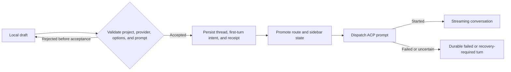

# MetaClanker conversation creation UX redesign

- Status: Implemented and verified (2026-08-01)
- Owner: Product and UX
- Audience: Design, frontend, application, server, persistence, desktop, and test owners
- Related contract: [MetaClanker product and architecture specification](../../SPEC.md)

## 1. Executive summary

MetaClanker's visual identity is distinctive, but its project and conversation creation flows make the
user manage application objects before they can describe the work they want done. The current welcome
surface has no primary action, Add project is form-first, New thread is hidden behind a project-row plus
button, and choosing a provider immediately creates an empty durable thread.

This redesign makes the composer the starting point. New chat opens a local draft in one action. The
user can choose the project, provider, model, effort, and permission mode around the composer, then the
first send creates the durable thread and starts its initial turn. Adding a project continues directly
into the same draft experience.

The interaction model is informed by T3 Code's intent-first draft flow. MetaClanker retains its own
brand, Vue architecture, ACP provider boundary, durable command receipts, recovery model, privacy rules,
and narrower MVP scope.

## 2. Problem statement

### 2.1 Current user journey

Starting a conversation in an existing project requires:

1. Find the small plus button on the correct project row.
2. Open a provider submenu.
3. Choose Codex or Claude.
4. Wait for an empty `New conversation` thread to be persisted and opened.
5. Find the composer and write the first prompt.

Starting from no registered project adds an absolute-path dialog and a second disconnected creation
step. After the project is accepted, the user returns to a welcome surface instead of continuing into
the new conversation.

### 2.2 Product consequences

- The primary task—asking an agent to do work—is visually and interactively secondary.
- Two visually similar plus icons perform different actions.
- Provider choice is detached from the composer controls it affects.
- Abandoned creation attempts leave empty thread rows with duplicate titles.
- The welcome surface consumes most of the viewport without offering an action.
- Project creation feels administrative rather than part of starting work.
- Keyboard and narrow-screen paths do not have one obvious entry point.

## 3. Product principles

### 3.1 Intent before persistence

Ask what the user wants to accomplish before creating a durable thread or provider session.

### 3.2 One continuous creation journey

Adding a project, choosing agent settings, writing the first prompt, and starting the conversation are
one journey. Successful completion of one step advances to the next useful state.

### 3.3 Reversible until send

Project, provider, model, effort, permission mode, attachments, and prompt content remain editable until
the first send. Opening or abandoning an empty draft has no server-side effect.

### 3.4 Honest durability

Before server acceptance, failure preserves the draft and creates no thread. After acceptance, failure
is represented as a durable failed or recovery-required turn and is never disguised as an unsent draft.

### 3.5 MetaClanker, not a T3 clone

Reuse the interaction lesson and conversation-shell hierarchy without copying T3 Code's component code,
assets, or expanded product scope. Keep MetaClanker's tokens, provider-neutral ACP behavior, durable
command contracts, recovery model, privacy rules, and conversation-plus-agent-map identity.

## 4. Goals and non-goals

### 4.1 Goals

- Open a ready composer with one New chat action when a project exists.
- Continue from successful project creation directly into a focused composer.
- Avoid durable empty threads and repeated `New conversation` rows.
- Make project and provider context visible and editable before first send.
- Derive the initial thread title from the first prompt.
- Preserve unsent work across local navigation and application restart.
- Provide equivalent desktop, web, keyboard, and narrow-screen journeys.
- Preserve exactly-once command, recovery, privacy, and provider capability contracts.

### 4.2 Non-goals

- Multi-environment catalogs or environment grouping.
- Repository cloning or remote source-provider onboarding.
- WSL specialization.
- Automatic worktree or branch creation.
- Snoozed, settled, or inbox-style thread management.
- Copying T3 Code assets, component code, or unsupported actions and worktree scope.
- Redesigning transcripts, review, terminal, or agent-map behavior beyond entry-state integration.

## 5. User-facing terminology

- Use **New chat** for the user action.
- Use **conversation** in general explanatory copy.
- Use **thread** only where the distinction is useful in technical or advanced UI.
- Use **project** for a registered server-side working directory.
- Never expose **draft promotion**, **command receipt**, or **projection** in user-facing copy.

## 6. Target information architecture

The expanded desktop sidebar is ordered as follows:

1. Product identity, compact New chat, and sidebar-collapse controls.
2. A quiet `Projects` heading with a distinct Add project action.
3. Project rows with their durable conversations nested directly below.
4. Settings.

New chat uses a compose/message icon. Add project uses the plus action beside the explicit `Projects`
heading. Their location, accessible names, tooltips, and adequate target sizes keep them distinct without
adding persistent toolbars, project-scope selects, or search fields to the sidebar.

Thread rows prioritize:

1. Actionable status or attention state.
2. Conversation title.
3. Recency.
4. Provider as supporting metadata when useful.

Project selection opens or returns to that project's local draft. A durable conversation activation
navigates to the conversation without changing the project tree structure.

## 7. New-chat experience

### 7.1 Entry points

New chat is available from:

- The primary sidebar action.
- The no-thread and no-selection empty states.
- The command palette.
- A configurable keyboard shortcut.
- A project context action.

Context resolution uses this order:

1. The active conversation's project.
2. The most recently active project.
3. The first visible project.
4. If no project exists, the add-project journey.

With multiple projects, the contextual result opens immediately and remains reversible through the
project selector. The command palette additionally offers `New chat in…` for explicit project selection.

### 7.2 Draft surface

An unsent conversation opens as a local draft in the same visual shell as a durable conversation. The
empty draft surface contains:

- A slim `New chat` header with an adjacent project selector and discard action.
- A quiet empty timeline message that does not compete with the composer.
- A restrained version of the normal composer anchored to the bottom of the conversation surface.
- Provider, model, effort, permission, and negotiated provider controls.
- Progressive-disclosure attach and send actions.
- A concise local-processing/privacy cue.

The composer receives focus when the draft opens. The empty workspace and draft surface omit decorative
agent-map art so project context and the composer remain the only visual priorities.

### 7.3 Draft behavior

- A draft is presentation state, not a domain thread, provider session, event, or command receipt.
- Draft content stays on the client until the user sends it.
- Maintain at most one unsent draft per project.
- Invoking New chat again for the same project returns to its existing draft.
- Preserve prompt, attachments, cursor, project, provider, model, effort, permission, and supported
  control choices during navigation and local application restart.
- Empty drafts may be discarded without confirmation.
- Discarding a non-empty draft requires an explicit action and confirmation.
- Drafts do not appear in the durable thread list or search results.

Provider choices come from normalized ACP readiness and capability state. The draft may preselect the
last usable provider and settings for the project. Authentication-required or unavailable providers stay
visible with their reason but cannot be presented as ready.

When a pinned adapter exposes no side-effect-free authentication-status operation, MetaClanker does not
create a probe session before the user sends. An authentication failure learned only while opening the
accepted provider session follows the same durable post-acceptance failure contract as any other adapter
startup failure.

### 7.4 First send and durable promotion

The first send is one user action and one stable command identity.

Required behavior:

1. Validate the project, provider readiness, negotiated settings, prompt, and attachments.
2. Submit a single stable command ID for durable thread creation and initial-turn dispatch.
3. Persist the accepted thread, title, initial turn intent, events, projection, and receipt before the
   external ACP prompt side effect.
4. Promote the draft route to the durable thread route without losing focus, optimistic message content,
   scroll position, attachments, or control state.
5. Remove the local draft only after server acceptance.

Validation, authentication, or capability rejection before acceptance creates no thread and preserves
the complete draft. Failure after acceptance follows the existing durable recovery contract. The client
must never blindly retry an uncertain first prompt.

### 7.5 Initial title

Derive the initial title from the first non-empty prompt by collapsing whitespace and truncating at a
shared documented limit. Attachment-only first turns use a descriptive attachment fallback. The title is
available with the accepted thread so a normal-latency transition does not visibly introduce a temporary
`New conversation` row. The user can rename the thread later.

## 8. Add-project experience

### 8.1 Entry points

Add project is available from:

- The sidebar project-scope row.
- The no-project empty state.
- The draft project selector.
- The command palette.
- New chat when no project exists.

### 8.2 Packaged desktop

The primary action opens the native directory picker. After selection:

- Infer the display name from the directory.
- Register a valid selection immediately and open its focused draft without a redundant confirmation
  form.
- Show path correction and optional name override controls only when validation fails.
- Return cancellation to the unchanged prior state.

### 8.3 Browser

Browser paths belong to the server environment. The primary interaction is a server-side directory
browser constrained to paths the server is permitted to inspect. Manual absolute-path entry is a
fallback. The UI must never imply that it is choosing a folder from the browser user's machine.

### 8.4 Validation and success

The project flow must:

- Validate existence and directory type.
- Validate the candidate root without broadening filesystem access.
- Detect Git metadata when present.
- Accept a non-Git directory with Git-dependent review and checkpoint actions visibly unavailable.
- Detect an already registered normalized path and open it instead of creating a duplicate.
- Keep selected and entered values after validation failure.
- Place the error beside the failing field and announce it accessibly.
- Infer the display name while allowing an override.
- On success, select the project and open its focused new-chat draft.

Adding a project does not create a durable thread. Removing a project remains distinct from deleting
source files.

## 9. Empty, loading, and failure states

Every empty or failure state provides one clear next action.

| State | Message | Primary action | Secondary action |
| --- | --- | --- | --- |
| No projects | `What should we work on?` | Add project | Open setup help/settings |
| Project with no threads | `What should we work on in {project}?` | Focus composer | Change project |
| No selected thread | `Pick up existing work or start something new.` | New chat | Select/search threads |
| No search results | `No conversations match {query}.` | Clear search | New chat |
| Provider unavailable | Name the provider and reason | Choose another provider | Open provider setup |
| Project validation failed | Explain the path problem | Correct and retry | Cancel |
| First send rejected | Preserve and explain the draft | Correct and retry | Choose another provider |

Loading project metadata or provider capabilities must not flash a false no-project or unavailable
state. Skeletons preserve the expected layout. Long-running validation shows progress and remains
cancellable when cancellation is safe.

## 10. Visual direction

- Keep MetaClanker's dark neutral canvas, lime semantic accent, and current tokens while removing
  decorative gradients and oversized empty-state typography.
- Make the composer the strongest element in an empty workspace.
- Use lime for the single primary action, focus, and meaningful active state—not every border.
- Keep titles visually stronger than provider, branch, timestamp, and status metadata.
- Express status with text or icon plus color, never color alone.
- Replace the project-row provider submenu rather than restyling it.
- Use distinct placement, icons, accessible names, and tooltips for New chat and Add project.
- Do not copy T3 Code layout, assets, text, or component styling.

Motion is limited to short state-preserving transitions for sidebar disclosure, composer repositioning,
and draft-to-thread promotion. Reduced-motion preferences remove nonessential movement. Animation may
not delay typing, focus, navigation, or sending.

## 11. Responsive and keyboard behavior

On narrow screens, the sidebar becomes a drawer and closes after thread activation. The draft headline,
project selector, and composer work without horizontal scrolling. Provider controls may collapse into an
accessible menu, but the selected provider and send readiness remain visible.

Required keyboard behavior:

- New chat shortcut opens or returns to the contextual draft and focuses the composer.
- The command palette exposes Add project and `New chat in…`.
- `Escape` closes menus and dialogs without discarding a non-empty draft.
- Enter sends; Shift+Enter inserts a newline; composition events are respected.
- Opening Add project focuses its primary browse/path control.
- Draft promotion retains logical focus in the conversation flow.

## 12. Accessibility requirements

- Meet WCAG 2.2 AA and the root specification's accessibility contract.
- New chat and Add project have distinct accessible names, icons, and visible labels when space allows.
- Menus and dialogs have names, focus containment, Escape behavior, and focus restoration.
- Project and provider controls expose selected, unavailable, expanded, and invalid states semantically.
- Errors are associated with fields and announced without requiring rediscovery.
- Complete add-project and first-prompt journeys work with keyboard only and at 200% zoom.
- Interactive targets are at least 24 by 24 CSS pixels; touch-primary targets are at least 44 by 44.
- Hover tooltips are never the only source of a control's meaning.
- Draft promotion produces no unexpected focus loss or duplicate landmark announcement.

## 13. Privacy, security, and recovery

- Unsent prompts and attachments stay in local client draft storage and are not transmitted to the
  server before send.
- Draft storage follows the same local privacy expectations as existing composer drafts and is excluded
  from logs and error payloads.
- Desktop directory selection crosses only the narrow typed preload bridge.
- Browser directory browsing is server-side and constrained; it never exposes unrestricted filesystem
  traversal.
- A draft cannot authorize operations outside a registered project root.
- First-send retries reuse the stable command identity.
- Accepted but uncertain ACP dispatch is surfaced as durable recovery-required state, never replayed.

## 14. Implementation boundaries

The implementation is expected to touch these ownership areas:

- `apps/web`: draft route/state, sidebar hierarchy, project scope/search, empty states, composer hero,
  focus, responsive behavior, and API orchestration.
- `packages/contracts`: public first-send command and result schemas if the transport contract changes.
- `packages/application`: the application command that accepts thread creation and initial-turn intent as
  one user action.
- `apps/server`: route decoding, command execution, subscription promotion, and typed error mapping.
- `packages/persistence`: atomic thread/event/projection/receipt acceptance before the ACP side effect.
- `apps/desktop`: reuse or narrowly extend the sandboxed directory-picker bridge.
- `packages/testing` and `tests/e2e`: deterministic first-send, retry, rejection, recovery, and packaged
  desktop path coverage.

Provider-specific JSON-RPC or capability decisions remain in `packages/acp-client`. Vue components do
not execute Effect programs. Draft rules that do not require I/O live in pure modules and receive focused
tests.

## 15. Test ownership

### 15.1 Browser feature coverage

- All New chat and Add project entry points.
- Contextual project resolution and explicit project switching.
- Draft retention, discard confirmation, and local restart restoration.
- Provider readiness and capability-dependent controls.
- Add-project validation, duplicate recovery, cancellation, focus, and success continuation.
- Pre-acceptance first-send rejection preserving every draft field.
- Draft-to-thread route promotion and focus retention.
- Empty, loading, no-result, and unavailable states.
- Keyboard, reduced-motion, narrow viewport, 200% zoom, and `axe-core` coverage.

### 15.2 Application and persistence coverage

- Exactly one accepted thread and initial turn for a repeated stable command ID.
- No thread/event/projection for a rejected first-send command.
- Atomic thread, initial event, projection, and receipt acceptance.
- Durable failed or recovery-required state after accepted dispatch failure.
- No blind resend after an uncertain provider effect.

### 15.3 End-to-end coverage

The primary production journey becomes:

1. Add a project through the server-side test picker.
2. Arrive in its focused draft.
3. Choose the fake Codex-like provider and supported controls.
4. Send the first prompt.
5. Observe exactly one durable titled thread and streamed turn.
6. Approve a tool request and review its diff.

Packaged desktop smoke additionally proves that the native directory picker result reaches the same
project-confirmation and draft outcome without widening the preload bridge.

## 16. Product acceptance criteria

The redesign is complete when:

1. One New chat activation focuses a ready composer when one project exists.
2. Adding the first valid project continues directly to its focused draft.
3. Opening, switching away from, restarting with, and abandoning an empty draft creates zero threads.
4. A non-empty draft survives navigation and local application restart without server transmission.
5. First send creates exactly one durable thread and initial turn under retry or reconnect conditions.
6. Pre-acceptance rejection preserves prompt, attachments, cursor, project, provider, model, effort, and
   permission state.
7. Post-acceptance dispatch failure appears as a durable failed or recovery-required conversation.
8. The first prompt supplies the initial sidebar title without a normal-latency `New conversation` phase.
9. Desktop folder selection and server-side browser selection reach the same confirmed project and draft
   outcome.
10. All entry points and critical states pass semantic-role, keyboard, focus, narrow-viewport,
    reduced-motion, and accessibility checks in their lowest useful test lanes.

## 17. Delivery plan

### Slice 1: Draft and first-send contract

- Add client draft identity, storage, routing, and contextual project resolution.
- Add exactly-once first-send acceptance and failure semantics.
- Add application, persistence, and browser regression coverage.
- Keep the existing sidebar until the complete slice is safe.

### Slice 2: Intent-first conversation surface

- Replace the welcome state with the centered draft composer.
- Move provider and negotiated settings into the pre-send composer context.
- Remove the project-row Codex/Claude submenu and immediate empty-thread creation.
- Continue successful existing project creation into the draft.

### Slice 3: Project onboarding

- Make native folder selection primary on desktop.
- Add the constrained server-side directory browser for web.
- Add inferred naming, duplicate-path recovery, field errors, and no-Git messaging.

### Slice 4: Sidebar and polish

- Add prominent New chat, search, project scope, and distinct Add project controls.
- Complete thread-row hierarchy, responsive behavior, keyboard flow, focus, motion, and accessibility.

Do not ship the new draft surface while it still creates an empty durable thread on entry. If the
first-send contract is incomplete, retain the old creation experience until Slice 1 is complete.

## 18. Definition of done

- Product acceptance criteria are demonstrated in automated tests at the lowest useful lanes.
- Web and packaged desktop behavior are both verified.
- Codex, Claude, unavailable-provider, non-Git, duplicate-project, and recovery behavior are covered.
- User-visible copy is in the message catalog.
- No accessibility rule, security boundary, typed contract, or retry invariant is weakened.
- The root product/architecture specification and README are updated when implementation lands.
- `pnpm check` and every affected boundary command pass before handoff.
